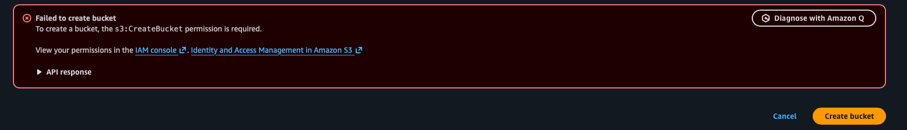
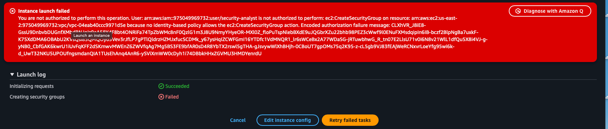
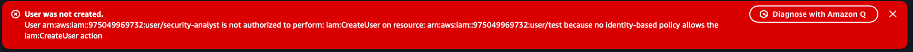
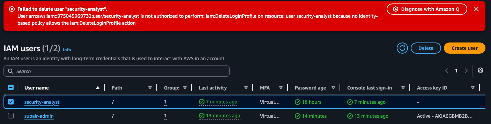

# Week 1: AWS Core Security (IAM)

## Objectives

- Learn IAM Users
- Learn IAM Groups
- Learn IAM Roles
- Learn IAM Policies
- Configure MFA
- Understand Authentication
- Understand Authorization
- Apply Least Privilege

## Environment

### Users

- subair-admin
- security-analyst

### Groups

- admin
- analysts

### Policies

#### AdministratorAccess
Assigned to:
- admin group

#### SecurityAnalystReadOnly
Custom policy providing read-only access to EC2, S3, and IAM resources.

### MFA

Enabled for:
- subair-admin
- security-analyst

## Authentication

Authentication is the process of verifying a user's identity before granting access. In this lab, authentication was implemented using IAM usernames, passwords, and Multi-Factor Authentication (MFA).

## Authorization

Authorization determines what actions an authenticated user is allowed to perform. AWS IAM policies, groups, and roles were used to define permissions.

## Least Privilege

The security-analyst account was granted only the permissions required to view resources. Administrative actions such as creating or deleting users were restricted.

## Key Takeaways

- IAM users represent identities.
- Groups simplify permission management.
- Policies define permissions.
- Roles provide temporary access.
- MFA strengthens authentication.
- Least privilege reduces risk.

## Authorization Testing

The security-analyst account was tested against administrative actions to validate least privilege controls.

### Create S3 Bucket (Denied)

### Launch EC2 Instance (Denied)

### Create IAM User (Denied)

### Delete IAM User (Denied)

